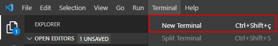

# Python Environment Setup

To avoid dependencies issues, this tutorial aims to help you how to create and configure a Conda Environment in VS Code. After cloning this repository to your machine, open VS Code in the folder where you cloned the repository. If you have done the setup with Git correctly, follow the following steps.

1. Go to Terminal tab in VS Code and select "New Terminal". Please, ensure that you have started a bash terminal.

<p align="center">
  
</p>

2. Run the following command to create a new Conda Environment:

```bash
conda create --name <your-environment-name> python=3.9.0
```

3. If you have created your environment with no errors, activate your Conda Environment running the following command:

```bash
conda activate <your-environment-name>
```

4. Install the required libraries using *pip* like as follows:

```bash
pip install tensorflow pandas numpy matplotlib sklearn
```

5. Finally, run this command:

```bash
conda install -c conda-forge --update-deps --force-reinstall ipykernel -y
```

After that, you can open the *mlp-regression-housingpricing.ipynb* notebook and select the right kernel (i.e., select the Conda Environment you have created).
